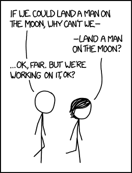

# Moon Landing 2022
### Mission Statement
To generate "fool-proof" documentation of the system that powers the NRG. That includes hardware, software, and wetware.

source: XKCD

## Google Cloud Transcription --> Docx
1. Get the audio file and upload to Google Cloud
2. Run the Google Cloud Transcription API
3. Download the file to `./data`
4. Run [Transcription Converter](./transcript-json_to_docx.ipynb)
5. Upload the generated docx (in `./output`) to google docs 
6. Change permissions of the document to world-writable
7. Let the crowdsourced clean up begin! :smiley: